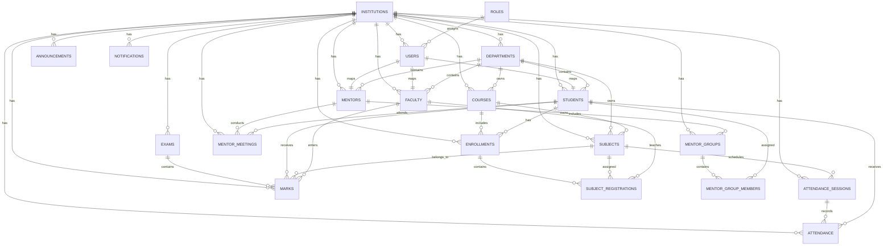

# 4. Database Schema

## Core Model

PostgreSQL relational schema for a multi-tenant higher education ERP.

### Multi-Tenancy Strategy

- `institutions` as top-level tenant
- Every major transactional table includes `institution_id`
- Optional future extension: `campus_id` for multi-campus enterprise accounts

## Main Tables

### institutions

| column | type | notes |
|---|---|---|
| id | uuid pk | institution id |
| name | varchar(180) | legal name |
| code | varchar(50) unique | short code |
| type | varchar(50) | university, college, institute |
| email | varchar(180) | primary contact |
| phone | varchar(30) | contact number |
| website | varchar(255) | website |
| timezone | varchar(80) | default timezone |
| status | varchar(30) | active, trial, suspended |
| created_at | timestamptz | audit |
| updated_at | timestamptz | audit |

### roles

| column | type | notes |
|---|---|---|
| id | uuid pk | role id |
| institution_id | uuid fk | tenant boundary |
| name | varchar(80) | super_admin, admin, faculty, mentor, student |
| description | text | role detail |
| created_at | timestamptz | audit |

### users

| column | type | notes |
|---|---|---|
| id | uuid pk | user id |
| institution_id | uuid fk | tenant boundary |
| role_id | uuid fk | primary role |
| first_name | varchar(100) | first name |
| last_name | varchar(100) | last name |
| email | varchar(180) unique | login identifier |
| phone | varchar(30) | mobile |
| password_hash | text | auth |
| avatar_url | text | profile |
| status | varchar(30) | active, invited, disabled |
| last_login_at | timestamptz | audit |
| created_at | timestamptz | audit |
| updated_at | timestamptz | audit |

### departments

| column | type | notes |
|---|---|---|
| id | uuid pk | department id |
| institution_id | uuid fk | tenant boundary |
| name | varchar(160) | department name |
| code | varchar(40) | short code |
| hod_user_id | uuid fk users.id | department head |
| status | varchar(30) | active/inactive |
| created_at | timestamptz | audit |

### courses

| column | type | notes |
|---|---|---|
| id | uuid pk | course/program id |
| institution_id | uuid fk | tenant boundary |
| department_id | uuid fk | parent department |
| name | varchar(180) | course name |
| code | varchar(40) | course code |
| degree_type | varchar(60) | btech, mba, ba |
| duration_semesters | int | total semesters |
| total_credits | int | aggregate credits |
| status | varchar(30) | active/inactive |
| created_at | timestamptz | audit |

### subjects

| column | type | notes |
|---|---|---|
| id | uuid pk | subject id |
| institution_id | uuid fk | tenant boundary |
| course_id | uuid fk | parent course |
| department_id | uuid fk | owning department |
| semester_no | int | semester |
| name | varchar(180) | subject name |
| code | varchar(40) | subject code |
| credits | numeric(4,1) | credit units |
| subject_type | varchar(40) | theory, lab, elective |
| created_at | timestamptz | audit |

### students

| column | type | notes |
|---|---|---|
| id | uuid pk | student id |
| institution_id | uuid fk | tenant boundary |
| user_id | uuid fk users.id | login identity |
| department_id | uuid fk | current department |
| course_id | uuid fk | current course |
| enrollment_no | varchar(80) unique | institution roll number |
| admission_year | int | batch year |
| current_semester | int | running semester |
| section | varchar(20) | section |
| dob | date | date of birth |
| gender | varchar(20) | optional |
| guardian_name | varchar(160) | parent/guardian |
| guardian_phone | varchar(30) | contact |
| status | varchar(30) | active, alumni, dropped |
| created_at | timestamptz | audit |

### mentors

| column | type | notes |
|---|---|---|
| id | uuid pk | mentor id |
| institution_id | uuid fk | tenant boundary |
| user_id | uuid fk users.id | user reference |
| department_id | uuid fk | department |
| employee_code | varchar(60) | HR code |
| designation | varchar(120) | mentor title |
| capacity | int | max mentees |
| status | varchar(30) | active/inactive |
| created_at | timestamptz | audit |

### faculty

| column | type | notes |
|---|---|---|
| id | uuid pk | faculty id |
| institution_id | uuid fk | tenant boundary |
| user_id | uuid fk users.id | user reference |
| department_id | uuid fk | department |
| employee_code | varchar(60) | faculty code |
| designation | varchar(120) | role title |
| status | varchar(30) | active/inactive |
| created_at | timestamptz | audit |

### enrollments

| column | type | notes |
|---|---|---|
| id | uuid pk | enrollment id |
| institution_id | uuid fk | tenant boundary |
| student_id | uuid fk | student |
| course_id | uuid fk | course |
| semester_no | int | semester |
| academic_year | varchar(20) | 2026-27 |
| status | varchar(30) | enrolled, completed, withdrawn |
| created_at | timestamptz | audit |

### subject_registrations

| column | type | notes |
|---|---|---|
| id | uuid pk | registration id |
| institution_id | uuid fk | tenant boundary |
| enrollment_id | uuid fk | enrollment |
| subject_id | uuid fk | subject |
| faculty_id | uuid fk | teaching owner |
| created_at | timestamptz | audit |

### attendance_sessions

| column | type | notes |
|---|---|---|
| id | uuid pk | session id |
| institution_id | uuid fk | tenant boundary |
| subject_id | uuid fk | subject |
| faculty_id | uuid fk | faculty |
| section | varchar(20) | class section |
| session_type | varchar(30) | lecture, lab |
| session_date | date | date |
| start_time | time | start |
| end_time | time | end |
| created_at | timestamptz | audit |

### attendance

| column | type | notes |
|---|---|---|
| id | uuid pk | attendance record |
| institution_id | uuid fk | tenant boundary |
| attendance_session_id | uuid fk | session |
| student_id | uuid fk | student |
| status | varchar(20) | present, absent, late, excused |
| remarks | text | optional |
| marked_by | uuid fk users.id | actor |
| marked_at | timestamptz | audit |

### mentor_groups

| column | type | notes |
|---|---|---|
| id | uuid pk | mentor group id |
| institution_id | uuid fk | tenant boundary |
| mentor_id | uuid fk | mentor owner |
| department_id | uuid fk | department |
| course_id | uuid fk | course |
| academic_year | varchar(20) | session year |
| section | varchar(20) | group section |
| group_name | varchar(100) | human label |
| created_at | timestamptz | audit |

### mentor_group_members

| column | type | notes |
|---|---|---|
| id | uuid pk | member link |
| institution_id | uuid fk | tenant boundary |
| mentor_group_id | uuid fk | group |
| student_id | uuid fk | student |
| added_at | timestamptz | audit |

### mentor_meetings

| column | type | notes |
|---|---|---|
| id | uuid pk | meeting id |
| institution_id | uuid fk | tenant boundary |
| mentor_id | uuid fk | mentor |
| student_id | uuid fk | student |
| mentor_group_id | uuid fk | optional group |
| meeting_date | date | date |
| meeting_mode | varchar(30) | in_person, phone, online |
| agenda | text | agenda |
| notes | text | summary |
| action_items | jsonb | structured follow-ups |
| risk_level | varchar(20) | low, medium, high |
| next_follow_up_at | timestamptz | follow-up |
| created_at | timestamptz | audit |

### exams

| column | type | notes |
|---|---|---|
| id | uuid pk | exam id |
| institution_id | uuid fk | tenant boundary |
| course_id | uuid fk | course |
| semester_no | int | semester |
| name | varchar(120) | midterm, internal 1 |
| exam_type | varchar(40) | internal, external, practical |
| max_marks | numeric(6,2) | total |
| weightage_percent | numeric(5,2) | contribution |
| exam_date | date | scheduled date |
| created_at | timestamptz | audit |

### marks

| column | type | notes |
|---|---|---|
| id | uuid pk | marks entry |
| institution_id | uuid fk | tenant boundary |
| exam_id | uuid fk | exam |
| student_id | uuid fk | student |
| subject_id | uuid fk | subject |
| faculty_id | uuid fk | evaluator |
| marks_obtained | numeric(6,2) | score |
| grade | varchar(10) | grade |
| remarks | text | optional |
| created_at | timestamptz | audit |

### announcements

| column | type | notes |
|---|---|---|
| id | uuid pk | announcement id |
| institution_id | uuid fk | tenant boundary |
| title | varchar(200) | title |
| body | text | message |
| audience_type | varchar(40) | all, students, mentors, faculty |
| department_id | uuid fk nullable | scoped audience |
| publish_at | timestamptz | schedule |
| expires_at | timestamptz | expiry |
| created_by | uuid fk users.id | author |
| created_at | timestamptz | audit |

### notifications

| column | type | notes |
|---|---|---|
| id | uuid pk | notification id |
| institution_id | uuid fk | tenant boundary |
| user_id | uuid fk users.id | recipient |
| channel | varchar(20) | in_app, email, push, sms |
| title | varchar(200) | title |
| body | text | content |
| status | varchar(20) | queued, sent, read, failed |
| sent_at | timestamptz | delivery time |
| read_at | timestamptz | read time |
| created_at | timestamptz | audit |

## Supporting Tables Recommended

- `academic_terms`
- `sections`
- `timetables`
- `assignments`
- `documents`
- `audit_logs`
- `integrations`
- `report_exports`
- `student_risk_scores`

## Key Relationships

- One institution has many roles, users, departments, courses, subjects, students, mentors, faculty, enrollments, mentor groups, exams, announcements, and notifications
- One user belongs to one primary role
- One student belongs to one user, department, and course
- One mentor belongs to one user and department
- One faculty belongs to one user and department
- One course belongs to one department
- One subject belongs to one course and department
- One enrollment belongs to one student and course
- One subject registration links enrollment, subject, and faculty
- One attendance session belongs to one subject and faculty
- Attendance records link attendance sessions to students
- One mentor group belongs to one mentor and includes many students through mentor group members
- Mentor meetings connect mentors with students and optional mentor groups
- Marks connect exams, students, subjects, and faculty

## ER Diagram Structure

