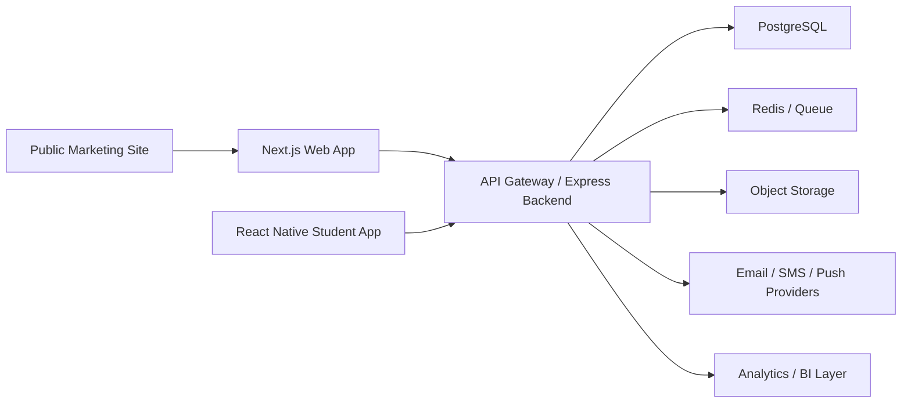

# 7. Deployment Architecture

## Marketing Website Deployment

- Hosting target for this repository: GitHub Pages
- Deployment artifact: static HTML, CSS, and JavaScript
- Branch strategy: push repository root and enable Pages from branch

## Current MVP Recommendation

- Deploy `apps/web` to Vercel
- Use Supabase for Postgres, auth, and storage
- Keep GitHub as the source of truth and deployment trigger
- Treat the separate Express app as optional future infrastructure, not a current MVP requirement

## Full SaaS Deployment Architecture

### Frontend

- Framework: Next.js
- Hosting: Vercel or Cloudflare Pages
- Delivery:
  - marketing pages as static
  - dashboard app as SSR or hybrid rendering
  - CDN caching for public pages

### Backend

- Runtime: Node.js + Express
- Hosting options:
  - Render
  - Railway
  - Fly.io
  - AWS ECS/Fargate
- Responsibilities:
  - auth and RBAC
  - business logic
  - reporting
  - notification orchestration
  - analytics APIs

### Database

- PostgreSQL
- Recommended managed providers:
  - Neon
  - Supabase Postgres
  - AWS RDS PostgreSQL
- Operational requirements:
  - automated backups
  - read replicas for analytics
  - point-in-time recovery

### Object Storage

- S3-compatible storage for:
  - student documents
  - report exports
  - faculty materials
  - announcement attachments

### Caching and Jobs

- Redis for:
  - session and token support
  - queue buffering
  - notification throttling
  - analytics caching
- Background workers for:
  - email and push notifications
  - report generation
  - attendance threshold checks
  - mentor follow-up reminders

### Mobile App

- React Native app for Android and iOS
- API communication via HTTPS
- Push notifications through Firebase Cloud Messaging and APNs bridge

## Logical Architecture

## Recommended Environments

- `local`
- `staging`
- `production`

## DevOps Requirements

- CI for lint, test, and build
- Migration pipeline for PostgreSQL schema changes
- Secrets management
- Role-based access logging
- Error monitoring
- Uptime monitoring

## GitHub Pages Note

GitHub Pages is suitable for the marketing site and public-facing content in this repository. It is not suitable for hosting the full Node.js API or PostgreSQL-backed ERP application. The full SaaS product should use a dedicated frontend host plus backend and database infrastructure.
